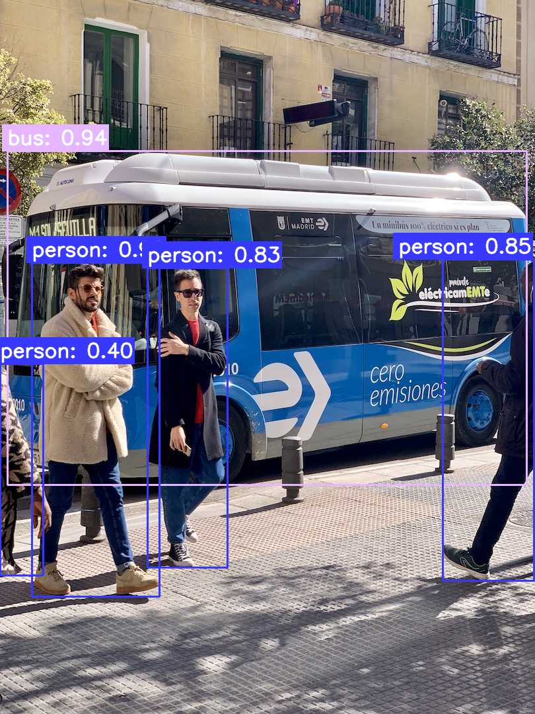
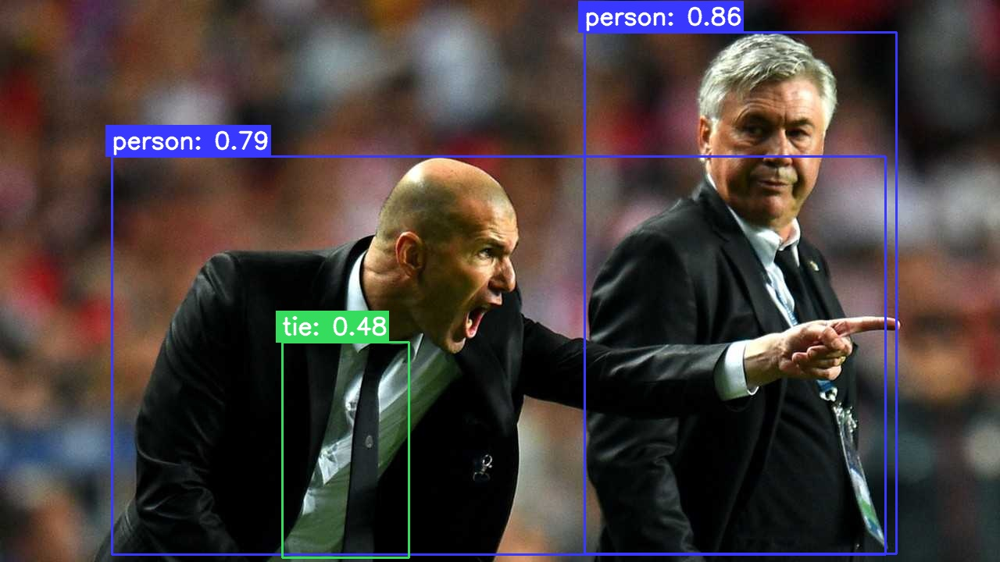


# YoloSharpOnnx
       [](https://www.nuget.org/packages/YoloSharpOnnx/) [](https://www.nuget.org/packages/YoloSharpOnnx/)

🚀a high performance, memory reuse, production-ready C# YOLO inference library for object detection  base on OpenCV and ONNX Runtime.

# Features
 - **YOLO Task**  [Object Detection](https://docs.ultralytics.com/tasks/detect) 
 - **Execution Provider** CPU, CUDA / TensorRT, OpenVINO, CoreML, DirectML
 - **Batch processing images** Preprocess and Inference are executed asynchronously  with Producer/Consumer pattern
 - **High Performance Inference** Memory reuse, GPU Inference with I/O Binding
 - **Image Processing** [OpenCvSharp4](https://github.com/shimat/opencvsharp)
 - **Inference Engine** [ONNX Runtime](https://github.com/microsoft/onnxruntime) is a cross-platform inference and training machine-learning accelerator.
 - **YOLO Versions** Includes support for: [YOLOv8](https://docs.ultralytics.com/models/yolov8), [YOLO11](https://docs.ultralytics.com/models/yolo11), [YOLO26](https://docs.ultralytics.com/models/yolo26)


## Example Images:
<div align="center">
 
| Object Detection Result  |
|---------------|
|  |
|  |

</div>

# Build Package 
Release x64

# Usage

### 1. Export model to ONNX format:

For convert the pre-trained PyTorch model to ONNX format, run the following Python code:

```python
from ultralytics import YOLO

# Load a model
model = YOLO('path/to/best.pt')

# Export the model to ONNX format
model.export(format='onnx')
```

### 2. Load the ONNX model with C#:

Install Nuget packages `YoloSharpOnnx`, `OnnxRuntime`, `OpenCvSharp4.runtime`

#### CPU Inference
```shell
dotnet add package YoloSharpOnnx
dotnet add package OpenCvSharp4.runtime.win
dotnet add package Microsoft.ML.OnnxRuntime
```

``` csharp
using YoloSharp yolo = new YoloSharp(new ExecutionProviderCPU("yolo11n.onnx"));
```

#### CoreML Inference
```shell
dotnet add package YoloSharpOnnx
dotnet add package OpenCvSharp4.runtime.osx.10.15-x64
dotnet add package Microsoft.ML.OnnxRuntime
```

```csharp
using YoloSharp yolo = new YoloSharp(new ExecutionProviderCoreML("yolo11n.onnx"));
```

#### CUDA/TensorRT Inference
```shell
dotnet add package YoloSharpOnnx
dotnet add package OpenCvSharp4.runtime.win
dotnet add package Microsoft.ML.OnnxRuntime.Gpu.Windows
```

```csharp
using YoloSharp yolo = new YoloSharp(new ExecutionProviderCUDA("yolo11n.onnx",0));
using YoloSharp yolo = new YoloSharp(new ExecutionProviderTensorRT("yolo11n.onnx",0));
```


#### DirectML Inference
```shell
dotnet add package YoloSharpOnnx
dotnet add package OpenCvSharp4.runtime.win
dotnet add package Microsoft.ML.OnnxRuntime.DirectML
```

```csharp
using YoloSharp yolo = new YoloSharp(new ExecutionProviderDirectML("yolo11n.onnx",0));
```

#### OpenVINO Inference
```shell
dotnet add package YoloSharpOnnx
dotnet add package OpenCvSharp4.runtime.win
dotnet add package Intel.ML.OnnxRuntime.OpenVino
```

```csharp
using YoloSharp yolo = new YoloSharp(new ExecutionProviderOpenVINO("yolo11n.onnx", IntelDeviceType.NPU));
```

#### Use the following C# code to load the model and run basic prediction:

```csharp

using Mat image = Cv2.ImRead("bus.jpg");
using YoloSharp yolo = new YoloSharp(new ExecutionProviderCPU("yolo11n.onnx"));

List<DetectionResult> res = yolo.RunDetect(image);

yolo.DrawDetections(image,res);
Cv2.ImWrite("bus_res.jpg", image);

string printString = YoloUtils.GetResult(res);
Console.WriteLine(printString)

```

#### YoloSharpOnnx performance testing api

```csharp

using Mat image = Cv2.ImRead("bus.jpg");
     
using YoloSharp yolo = new YoloSharp(new ExecutionProviderDirectML("yolo11n.onnx",1));
var res = yolo.RunDetectWithTime(item.FullName);

Console.WriteLine($"{res.ToString()}, {res.SpeedResult.ToString()}");

```

#### Config 
```csharp
using Mat image = Cv2.ImRead("bus.jpg");
using YoloSharp yolo = new YoloSharp(new ExecutionProviderCPU("yolo11n.onnx"));
yolo.YoloConfiguration.IoU = 0.4f;
yolo.YoloConfiguration.Confidence = 0.3f;
yolo.YoloConfiguration.ResizeAlgorithm = InterpolationFlags.Linear;
yolo.YoloConfiguration.ImageExtsBatch = [".jpg", ".png"];
var res = yolo.RunDetect(image);
```

#### Asynchronous inference
```csharp
private static async Task TestInferAsync()
{
    string modelPath = @"D:\code\model\best.onnx";
    string dir = @"D:\code\model\TestImages";
    using var yolo = new YoloSharp(new ExecutionProviderDirectML(modelPath, 1));
    System.Diagnostics.Stopwatch _stopwatchTotal = new System.Diagnostics.Stopwatch();
    _stopwatchTotal.Start();
    var files = Directory.GetFiles(dir);
    using (var yoloAsync = yolo.CreateAsyncChannel())
    {
        
        for (int i = 0; i < files.Length; i++)
        {
            var res = await yoloAsync.RunDetectAsync(files[i]);
            Console.WriteLine($"{i + 1} {YoloUtils.GetResult(res)}");
        }
    }
    _stopwatchTotal.Stop();
    var avg = _stopwatchTotal.ElapsedMilliseconds / files.Length;
    Console.WriteLine($"total time:{_stopwatchTotal.Elapsed}, count:{files.Length} Infer avg time:{avg}ms");
}

```

#### Batch processing images

```csharp
private static void TestBatchInfer()
{
    string modelPath = @"D:\code\model\best.onnx";
    string dir = @"D:\code\model\TestImages"
    DirectoryInfo directory = new DirectoryInfo(dir);
    var files = directory.GetFiles()
    System.Diagnostics.Stopwatch _stopwatch = new System.Diagnostics.Stopwatch();
    _stopwatch.Start();
    int num=files.Length;
    using (YoloSharp yolo = new YoloSharp(new ExecutionProviderDirectML(modelPath, 0)))
    {
        yolo.BatchDetectItemCompleted += Yolo_BatchDetectCompleted
        var list = yolo.RunBatchDetect(dir,new ProcessCallback(), ReceiveProcess, 30)
    }
    _stopwatch.Stop()
    Console.WriteLine($"detect {num} images, time:{_stopwatch.Elapsed}");

private static void Yolo_BatchDetectCompleted(object? sender, DetectionBatchResult e)
{
    string ans = YoloUtils.GetResult(e.Results);
    Console.WriteLine(ans);

private static void ReceiveProcess(DetectionBatchResult e)
{
   
    string res = YoloUtils.GetResult(e.Results)
}
internal class ProcessCallback : IBatchProcessCallback
{
   
    public void ReceiveProcessResult(DetectionBatchResult e)
    {
       
        string res = YoloUtils.GetResult(e.Results);
      
    }
}

```
# Performance Test

|Yolo C# inference library|Version|Image Processing library|Image Resize Algorithm|Sequence inference| Batch inference|
| ------------- | ------------- | ------------- |------------- |------------- |------------- |
| [YoloSharp](https://github.com/dme-compunet/YoloSharp)| 6.1.0 |SixLabors.ImageSharp 3.1.12|  Triangle(Bilinear)|support | not support |
| [YoloDotNet](https://github.com/NickSwardh/YoloDotNet)| 4.2.0 |SkiaSharp 3.119.1| Linear(Bilinear) |support | support |
| [YoloSharpOnnx](https://github.com/meloht/YoloSharpOnnx)| 1.2.4 |OpenCvSharp4 4.13.0.20260318|Linear(Bilinear)|support | support |

## Performance Test Tool 
[YoloOnnxWinform](https://github.com/meloht/YoloOnnxWinform)

## Performance Test PC 

|Hardware|Summary|
| ------------- | ------------- | 
|Windows |Windows 10 OS Version 19045.6466|
|CPU| AMD Ryzen 7 5800X 8-Core Processor 3.8GHz|
|Memory| DDR4 3200 MHz 32GB|
|GPU| AMD Radeom RX6800 16GB|
|Storage| SSD 2TB|

## Performance Test Data

**Images:**  300 images (image size: 2480x3494)

**Yolo Model:**  Yolo11n.onnx InputShape 1280x1280

**Inference Provider:**  DirectML Inference Microsoft.ML.OnnxRuntime 1.24.3


## YoloSharp test result

**Sequence inference time:** 18.707s  **Memory Usage:** 1374M


## YoloDotNet test result

**Sequence inference time:** 17.665s **Memory Usage:** 169M

**Batch inference time:** 10.587s **Memory Usage:** 639M


## YoloSharpOnnx test result

**Sequence inference time:** 15.303s **Memory Usage:** 169M

**Batch inference time:** 3.492s **Memory Usage:** 601M


## Performance Test Result

|Yolo C# inference library|Version|Image Processing library|Image Resize Algorithm|Sequence inference (Time/Memory)| Batch inference (Time/Memory)|
| ------------- | ------------- | ------------- |------------- |------------- |------------- |
| [YoloSharp](https://github.com/dme-compunet/YoloSharp)| 6.1.0 |SixLabors.ImageSharp 3.1.12| Triangle(Bilinear)| 18.707s, 1374M | - |
| [YoloDotNet](https://github.com/NickSwardh/YoloDotNet)| 4.2.0 |SkiaSharp 3.119.1| Linear(Bilinear)| 17.665s, 169M | 10.587s, 639M |
| [YoloSharpOnnx](https://github.com/meloht/YoloSharpOnnx)| 1.2.4 |OpenCvSharp4 4.13.0.20260318|Linear(Bilinear)| 15.303s, 169M | 3.492s, 601M ||


| YoloSharpOnnx |YoloSharp |YoloDotNet |
| ------------- | ------------- | ------------- |
| | |  |


**The accuracy and performance of YoloSharpOnnx are the best !!!**

# Roadmap

| Time  | Feature |
| ------------- | ------------- |
| 2026-10  | Yolo task Image Classification  |
| 2026-11  | Yolo task Instance Segmentation  |
| 2026-11  | Yolo task Pose Estimation  |
| 2026-12  | Yolo task OBB  |

# Model Licensing & Responsibility

* YoloSharpOnnx is licensed under the [MIT License](./LICENSE.txt) and provides an ONNX inference
engine for YOLO models exported using Ultralytics YOLO tooling.

* This project does **not** include, distribute, download, or bundle any
pretrained models.

* Users must supply their own ONNX models.

* YOLO ONNX models produced using Ultralytics tooling are typically licensed
under **AGPL-3.0** or a separate commercial license from Ultralytics.

* YoloSharpOnnx does **not** impose, modify, or transfer any license terms related
to user-supplied models.

* **Users are solely responsible** for ensuring that their use of any model
complies with the applicable license terms, including requirements related
to commercial use, distribution, or network deployment.
  
